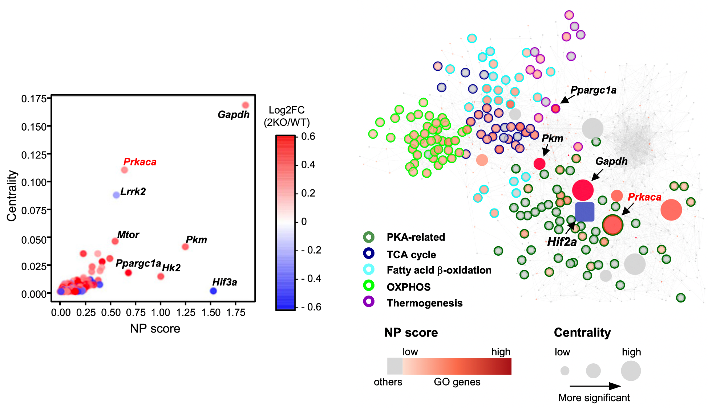

# Adipocyte HIF2α functions as a thermostat via PKA Cα regulation in beige adipocytes [[link]](https://www.nature.com/articles/s41467-022-30925-0)

  

## About data
data description~

##### *About path*

